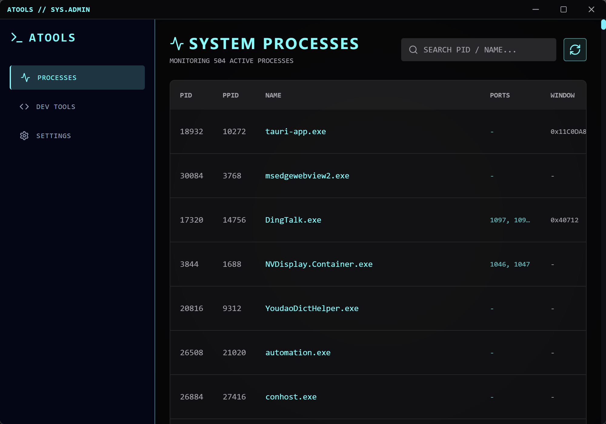
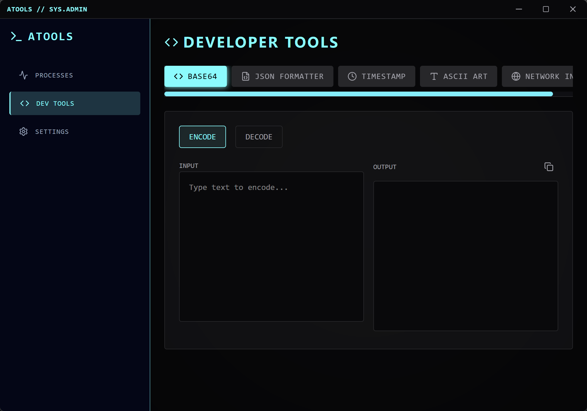
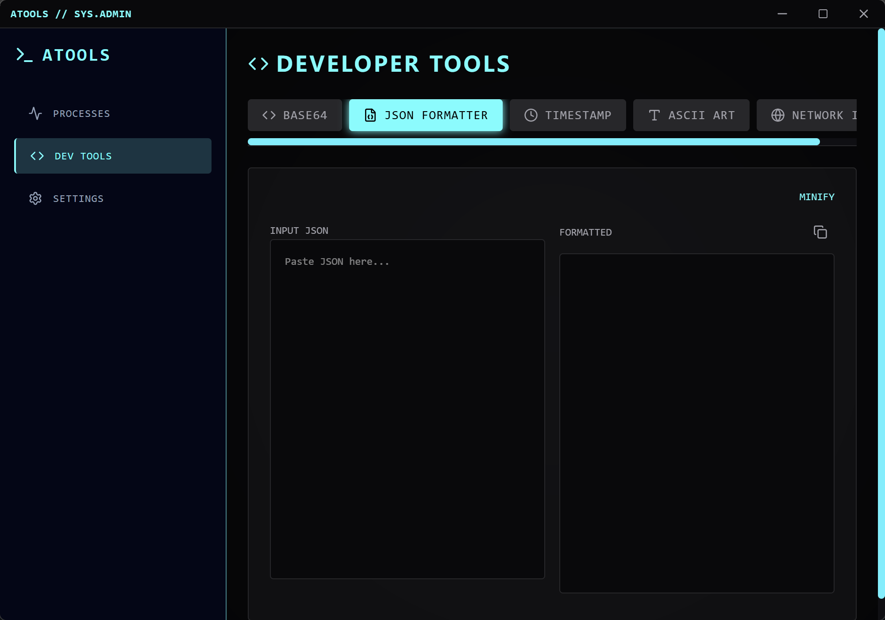
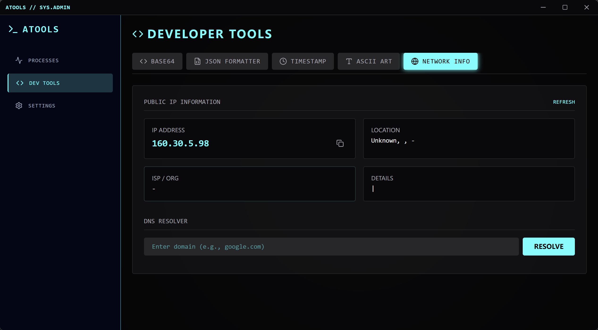
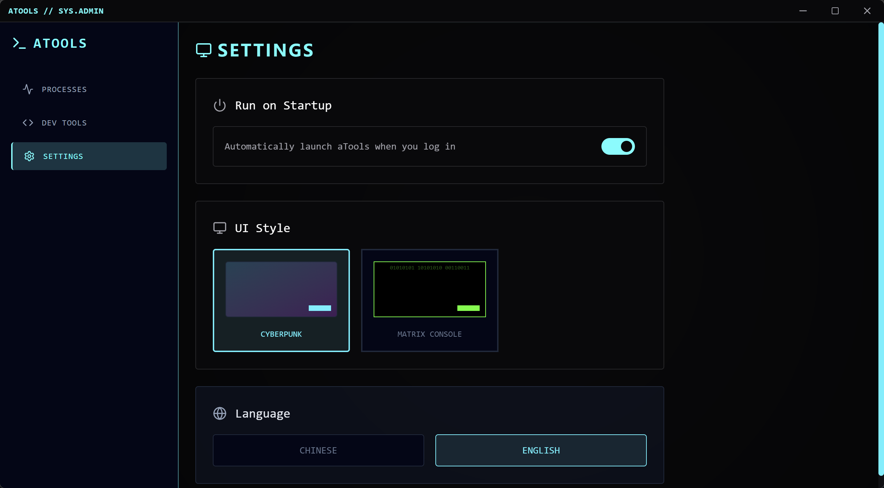

# aTools - Cyberpunk System Utilities

[中文文档](README_zh.md) | **English**

**aTools** is a high-performance system utility toolkit built with **Tauri**, **React**, and **Rust**. Designed with a distinct Cyberpunk aesthetic, it provides essential tools for developers and power users in a lightweight, native application.


## 📸 Screenshots

<div align="center">
  <h3>Process Viewer & Cyberpunk Theme</h3>
  
  
  <h3>Developer Tools (JSON & Base64)</h3>
  
  

  <h3>Network Info & Settings</h3>
  
  
</div>

## ✨ Features

### 🖥️ System Monitor
- **Process Viewer**: Real-time tracking of system processes.
- **Details**: View PID, Name, User, Memory Usage, CPU Usage, and Running status.
- **Native Performance**: Powered by Rust for minimal overhead.

### 🛠️ Developer Tools
- **Base64 Converter**: Encode and decode text instantly.
- **JSON Formatter**: Prettify and minify JSON data with syntax highlighting.
- **Timestamp Converter**: Convert between Unix timestamps and human-readable dates.
- **ASCII Art Generator**: Generate text-based art using FIGlet.
- **Network Tools**: 
  - View Public IP, Location, ISP, and ASN details.
  - DNS Resolver for quick domain lookups.

### 🎨 Customization
- **Cyberpunk Theme**: High-contrast, neon-glitched aesthetic.
- **Hacker Theme**: Classic green-on-black terminal style.
- **Internationalization (i18n)**: Full support for **English** and **Chinese (Simplified)**.

## 🚀 Tech Stack

- **Frontend**: React, TypeScript, Tailwind CSS, Framer Motion
- **Backend (Core)**: Rust (Tauri)
- **State Management**: React Context API
- **Icons**: Lucide React

## 📦 Installation & Setup

### Prerequisites
- [Node.js](https://nodejs.org/) (v16+)
- [Rust](https://www.rust-lang.org/) (latest stable)
- [Visual Studio Build Tools](https://visualstudio.microsoft.com/visual-cpp-build-tools/) (for Windows)

### Development
1. Clone the repository
2. Install dependencies:
   ```bash
   npm install
   # or
   pnpm install
   ```
3. Run in development mode:
   ```bash
   npm run tauri dev
   ```

### Building for Production
To create an optimized installer for your OS:

```bash
npm run tauri build
```
The artifacts (setup.exe / .msi) will be generated in `src-tauri/target/release/bundle/`.

## 📜 License
MIT License
